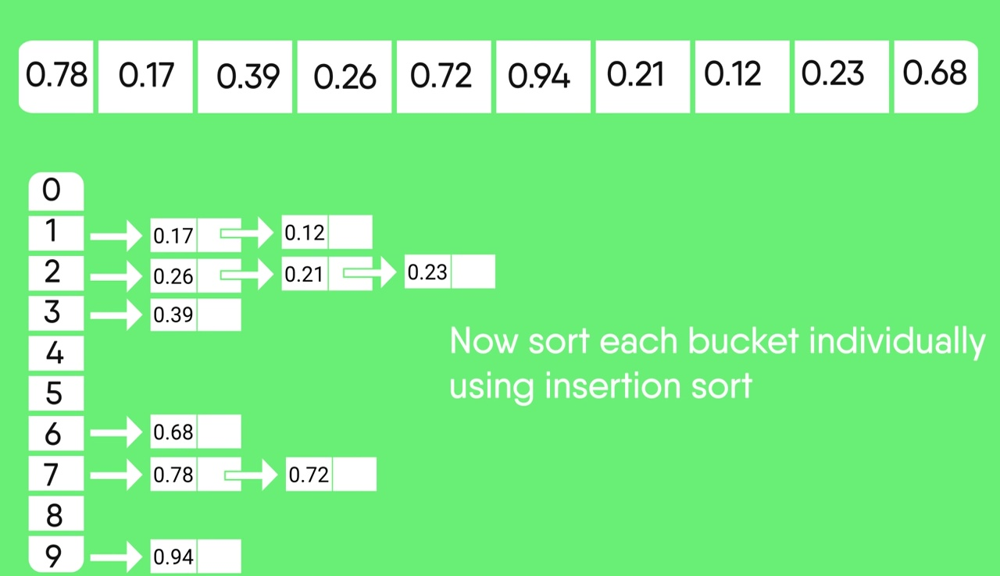

# Data Structures and Algorithms in Java

Install -> https://github.com/Sathvik-Rao/Data_Structures_and_Algorithms_in_Java/archive/master.zip

###### package structure

```
dsa
├───algorithms
│   ├───problems
|   |   └───MaximumSubArraySum.java         (primitive types)
│   ├───sort
|   |   ├───BubbleSort.java                 (primitive types + Object type)
|   |   ├───BucketSort.java                 (float + Float + double + Double)
|   |   ├───CountingSort.java               (char + byte + short + int)
|   |   ├───HeapSort.java                   (primitive types + Object type)
|   |   ├───InsertionSort.java              (primitive types + Object type)
|   |   ├───MergeSort.java                  (primitive types + Object type)
|   |   ├───QuickSort.java                  (primitive types + Object type)
|   |   ├───RadixSort.java                  (char + byte + short + int + long)
|   |   ├───RandomizedQuickSort.java        (primitive types + Object type)
|   |   └───SelectionSort.java              (primitive types + Object type)
|   └───search
|       └───LinearSearch.java               (primitive types + Object type)
└───datastructures
    ├───heap
    |   └───Heap.java                       (Object type)
    ├───linkedlist
    |   └───Linked_List.java                (primitive types)
    ├───list
    |   └───DynamicArray.java               (primitive types)
    ├───queue
    |   ├───QueueArray.java                 (primitive types)
    |   └───QueueLinkedList.java            (primitive types)
    └───stack
        ├───StackArray.java                 (primitive types)
        └───StackLinkedList.java            (primitive types)
```

Documentation/Help -> ```documentation\index.html```

Example program    -> ```Example.java```

----------------------------------------------------------------------------------------

###### MaximumSubArraySum


----------------------------------------------------------------------------------------

###### BubbleSort


----------------------------------------------------------------------------------------

###### BucketSort



----------------------------------------------------------------------------------------

###### CountingSort


----------------------------------------------------------------------------------------

###### HeapSort


----------------------------------------------------------------------------------------

###### InsertionSort


----------------------------------------------------------------------------------------

###### MergeSort


----------------------------------------------------------------------------------------

###### RadixSort


----------------------------------------------------------------------------------------

###### RandomizedQuickSort


----------------------------------------------------------------------------------------

###### SelectionSort


